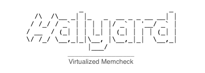

<style>
      p.header {
            color: #A9A9A9;
      }
</style>

<div align="center">
      
      <p class="header">
          <small>A command-line tool that allows you to quickly memcheck code.</small>
      </p>
</div>

## Getting Started

### Preqeuisties

In order to install Halyard you will need to have:

* [x] [Docker](https://www.docker.com/get-started) installed and

* [x] `/usr/local/bin` included in `$PATH`
  
### Install

To install, copy and paste this command into your terminal.

```bash
$ /bin/bash -c "$(curl -fsSL https://raw.githubusercontent.com/parkerduckworth/halyard/master/install)"
```
 _Note: If you do not have permission to write to `/usr/local/`, you may need to run with `sudo`. This will change in the future._


### Uninstall

To uninstall, copy and paste this command into your terminal.

```bash
$ /bin/bash -c "$(curl -fsSL https://raw.githubusercontent.com/parkerduckworth/halyard/master/uninstall)"
```

_Similarly, you may need to run with `sudo`_

### Usage

**Load** files into container.

```bash
$ halyard [-y] load [<dir> | <file> | <file 1> ... <file n>]
```

**Run** it

```bash
$ halyard run
```

**Peek** the current contents of the container.

```bash
$ halyard peek
```

**Clean** the current container before `load`ing a new set of programs.

```bash
$ halyard clean
```

**Reload** files after you have made changes. 
_Note: this will overwrite files within the container._

```bash
$ halyard reload [<dir> | <file> | <file 1> ... <file n>]
```

### Testing

### Contributing
